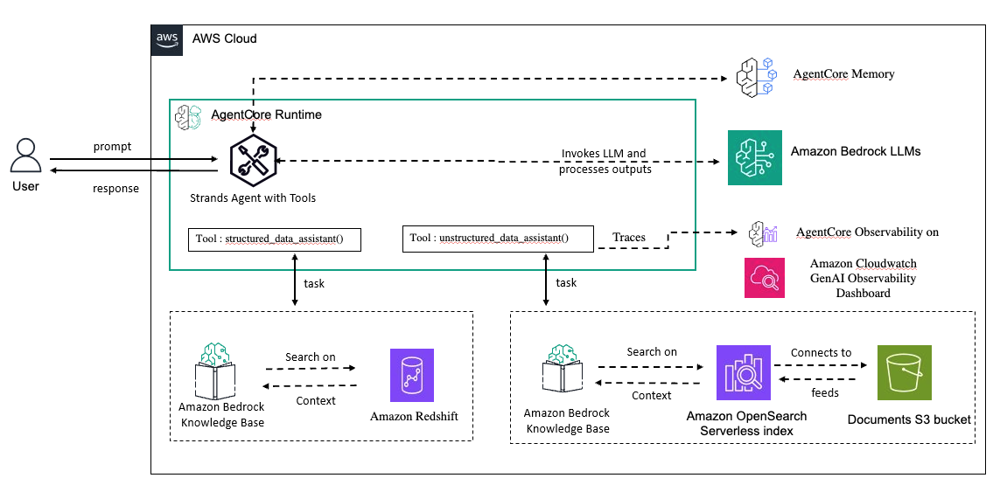

# 🤖 Unstructured-Structured RAG Agent

This project demonstrates how to build an intelligent RAG system that can route queries between **structured** and **unstructured** knowledge bases using **Strands Agents** and **Amazon Bedrock AgentCore**.

## 📋 Overview

The system intelligently routes user queries to the most appropriate knowledge base:

- **🗂️ Unstructured Knowledge Base**: Handles document-based, narrative, and conceptual queries using product reviews and documents
- **📊 Structured Knowledge Base**: Manages data analysis, metrics, and quantitative queries using Amazon Redshift with e-commerce transactional data  
- **🧠 Intelligent Routing Agent**: Uses Strands Agent to automatically determine which knowledge base to query based on the user's intent
- **☁️ AgentCore Deployment**: Deploy and scale the agent using Amazon Bedrock AgentCore with memory capabilities

## 🏗️ Architecture



## ✨ Key Features

| Feature | Description |
|---------|-------------|
| 🤖 Agent Structure | Single intelligent routing agent with dual knowledge base access |
| 🗂️ Unstructured Knowledge Base | Amazon Bedrock Knowledge Base with OpenSearch Serverless vector store |
| 📊 Structured Knowledge Base | Amazon Bedrock Knowledge Base connected to Amazon Redshift Serverless |
| 🛠️ Custom Tools | structured_data_assistant, unstructured_data_assistant |
| 🧠 Model Provider | Amazon Bedrock (Claude 3.5+ models, Nova models) |
| 🌐 Inference Profiles | Cross-region model access with inference profiles |
| ☁️ AgentCore Integration | Serverless deployment with memory and observability |

## 📁 Project Structure

```
unstructured-structured-rag-agent/
├── Lab 1 - Unstructured KB/
│   ├── 1.1-prerequisites-unstructured-kb.ipynb       # Setup unstructured KB
│   ├── 1.2-test-unstructured-kb.ipynb               # Test unstructured KB
│   └── sample_unstructured_data/                     # Product review documents
│       └── selected_reviews/                         # 64 review files with metadata
├── Lab 2 - Structured KB/
│   ├── 2.1-prerequisites-structured-kb.ipynb        # Setup structured KB
│   ├── 2.2-test-structured-kb.ipynb                 # Test structured KB
│   └── sample_structured_data/                       # E-commerce CSV data
│       ├── orders.csv
│       ├── order_items.csv
│       ├── payments.csv
│       └── reviews.csv
├── Lab 3 - AgentCore Deployment and Memory/
│   ├── 3.1-agentcore-deployment.ipynb               # Deploy to AgentCore
│   ├── 3.2-agentcore-memory.ipynb                   # Memory integration
│   ├── 3.3-agentcore-observability.ipynb            # Monitoring & observability
│   ├── intelligent_rag_agent_runtime.py             # Agent runtime code
│   ├── intelligent_rag_agent_runtime_with_memory.py # Agent with memory
│   ├── requirements.txt                              # AgentCore dependencies
│   ├── policy.json                                   # IAM policy
│   └── trust-policy.json                            # IAM trust policy
├── utils/
│   ├── knowledge_base.py                            # Unstructured KB utilities
│   └── structured_knowledge_base.py                 # Structured KB utilities
├── images/                                          # Architecture diagrams
├── Cleanup-Instructions.ipynb                       # Resource cleanup guide
├── pyproject.toml                                   # Python dependencies
└── README.md                                        # This file
```

## 🔧 Prerequisites

### System Requirements
- **Python 3.13** 
- **AWS Account** with appropriate permissions
- **uv** package manager (required for dependency management)

### AWS Services & Models
- **Amazon Bedrock foundation models enabled**:
  - **Primary Model**: `global.anthropic.claude-haiku-4-5-20251001-v1:0` (Claude Haiku 4.5)
  - **Embedding Models**: `amazon.titan-embed-text-v2:0` or `cohere.embed-v4:0`
  - **Reranking Models**: `cohere.rerank-v3-5:0` or `amazon.rerank-v1:0`

### IAM Permissions Required
- Amazon Bedrock Knowledge Bases
- Amazon Bedrock AgentCore
- Amazon S3
- Amazon OpenSearch Serverless  
- Amazon Redshift Serverless
- IAM role creation and management

## 🚀 Step-by-Step Setup

### Lab 1: Unstructured Knowledge Base

#### 1.1 Prerequisites Setup (`1.1-prerequisites-unstructured-kb.ipynb`)
**Purpose**: Creates a knowledge base for qualitative, document-based queries

**Creates**:
- 🪣 **S3 Bucket**: `product-reviews-unstructured-{suffix}-bucket`
- 📄 **Document Upload**: 64 product review documents with metadata
- 🔍 **OpenSearch Serverless Collection**: Vector store for embeddings
- 🗂️ **Unstructured Bedrock Knowledge Base**: Configured with S3 data source
- 🔐 **IAM Roles**: Execution role with proper permissions
- 🌐 **Inference Profile Policies**: For Claude 3.5+ model access

#### 1.2 Test Unstructured KB (`1.2-test-unstructured-kb.ipynb`)
**Purpose**: Validates unstructured knowledge base functionality

**Tests**:
- ✅ **Basic Retrieval**: Document retrieval and response generation
- 🏷️ **Metadata Filtering**: Product-specific filtering

### Lab 2: Structured Knowledge Base

#### 2.1 Prerequisites Setup (`2.1-prerequisites-structured-kb.ipynb`)
**Purpose**: Creates a knowledge base for quantitative, analytical queries

**Creates**:
- 🏢 **Redshift Serverless**: Namespace `sds-ecommerce-{suffix}` and workgroup
- 🪣 **S3 Bucket**: `sds-ecommerce-redshift-{suffix}` for data staging
- 📊 **Database Tables**:
  - `orders` (order information)
  - `order_items` (product details)
  - `payments` (payment transactions)
  - `reviews` (review ratings)
- 🔐 **IAM Roles**: Redshift access roles and Knowledge Base execution role
- 📈 **Structured Bedrock Knowledge Base**: Configured with Redshift as data source

#### 2.2 Test Structured KB (`2.2-test-structured-kb.ipynb`)
**Purpose**: Validates structured knowledge base functionality

**Tests**:
- 🔍 **SQL Query Generation**: Natural language to SQL conversion
- 📊 **Data Analysis**: Revenue, customer, and product analytics

### Lab 3: AgentCore Deployment and Memory

#### 3.1 AgentCore Deployment (`3.1-agentcore-deployment.ipynb`)
**Purpose**: Deploy the intelligent RAG agent to Amazon Bedrock AgentCore

**Features**:
- ☁️ **Serverless Deployment**: Deploy agent to AgentCore platform
- 🛠️ **Tool Integration**: Configure structured and unstructured data tools
- 🔧 **Agent Configuration**: Set up intelligent routing logic
- 🌐 **API Access**: Create REST API endpoints for agent interaction

#### 3.2 AgentCore Memory (`3.2-agentcore-memory.ipynb`)
**Purpose**: Integrate memory capabilities for enhanced agent performance

**Features**:
- 🧠 **Memory Integration**: Add persistent memory to agent
- 📝 **Context Retention**: Maintain conversation history
- 🔄 **Learning Capabilities**: Improve responses over time
- 📊 **Memory Analytics**: Track memory usage and effectiveness

#### 3.3 AgentCore Observability (`3.3-agentcore-observability.ipynb`)
**Purpose**: Monitor and observe agent performance in production

**Features**:
- 📈 **Performance Monitoring**: Track agent response times and accuracy
- 🔍 **Request Tracing**: Monitor individual request flows
- 📊 **Usage Analytics**: Analyze agent usage patterns
- 🚨 **Error Tracking**: Monitor and debug agent issues


## 🔧 Technical Details

### 🤖 Supported Models

#### Foundation Models (Direct Access)
- **Claude 3.5 Sonnet v2**: `anthropic.claude-3-5-sonnet-20241022-v2:0`
- **Claude 3.5 Haiku**: `anthropic.claude-3-5-haiku-20241022-v1:0`
- **Claude 3 Sonnet**: `anthropic.claude-3-sonnet-20240229-v1:0`
- **Claude 3 Haiku**: `anthropic.claude-3-haiku-20240307-v1:0`

#### Inference Profiles (Cross-Region)
- **Claude 4.5 Haiku**: `global.anthropic.claude-haiku-4-5-20251001-v1:0`
- **Claude 4.5 Sonnet**: `global.anthropic.claude-sonnet-4-5-20250929-v1:0`
- **Claude 4 Sonnet**: `global.anthropic.claude-sonnet-4-20250514-v1:0`

#### Amazon Nova Models
- **Nova Micro**: `amazon.nova-micro-v1:0`
- **Nova Lite**: `amazon.nova-lite-v1:0`
- **Nova Pro**: `amazon.nova-pro-v1:0`
- **Nova Premier**: `amazon.nova-premier-v1:0`

#### Embedding & Reranking Models
- **Embeddings**: `amazon.titan-embed-text-v2:0`
- **Reranking**: `cohere.rerank-v3-5:0`, `amazon.rerank-v1:0`

### 📊 Data Sources
- **Unstructured**: Product review documents with metadata (64 files)
- **Structured**: E-commerce transactional data (orders, payments, reviews)

### 🏷️ Resource Naming Convention
All resources use a timestamp-based suffix to avoid naming conflicts:
- **Format**: `{resource-name}-{4-digit-timestamp}`
- **Example**: `product-reviews-unstructured-kb-1210`

### 📦 Dependencies
Key Python packages (see `pyproject.toml` for complete list):
- `strands-agents>=1.13.0` - Core agent framework
- `bedrock-agentcore>=1.0.3` - AgentCore integration
- `boto3` - AWS SDK
- `opensearch-py==2.7.1` - OpenSearch client
- `pydantic>=2.10.2` - Data validation

## 🧹 Cleanup

Each notebook includes cleanup sections to delete created resources:

- 🗂️ Knowledge Bases and data sources
- 🪣 S3 buckets and objects  
- 🏢 Redshift Serverless infrastructure
- 🔐 IAM roles and policies
- 🔍 OpenSearch Serverless collections
- ☁️ AgentCore deployments

**⚠️ Important**: Run cleanup sections to avoid ongoing AWS charges.

## 📚 Additional Resources

- [Strands Agents Documentation](https://docs.strands.ai/)
- [Amazon Bedrock AgentCore Documentation](https://docs.aws.amazon.com/bedrock/latest/userguide/agentcore.html)
- [Amazon Bedrock Knowledge Bases](https://docs.aws.amazon.com/bedrock/latest/userguide/knowledge-base.html)
- [Amazon OpenSearch Serverless](https://docs.aws.amazon.com/opensearch-service/latest/developerguide/serverless.html)
- [Amazon Redshift Serverless](https://docs.aws.amazon.com/redshift/latest/mgmt/working-with-serverless.html)

