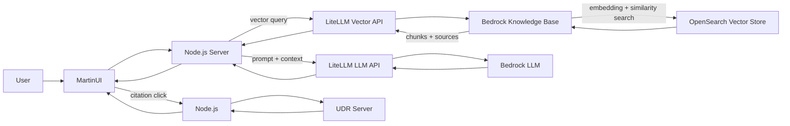
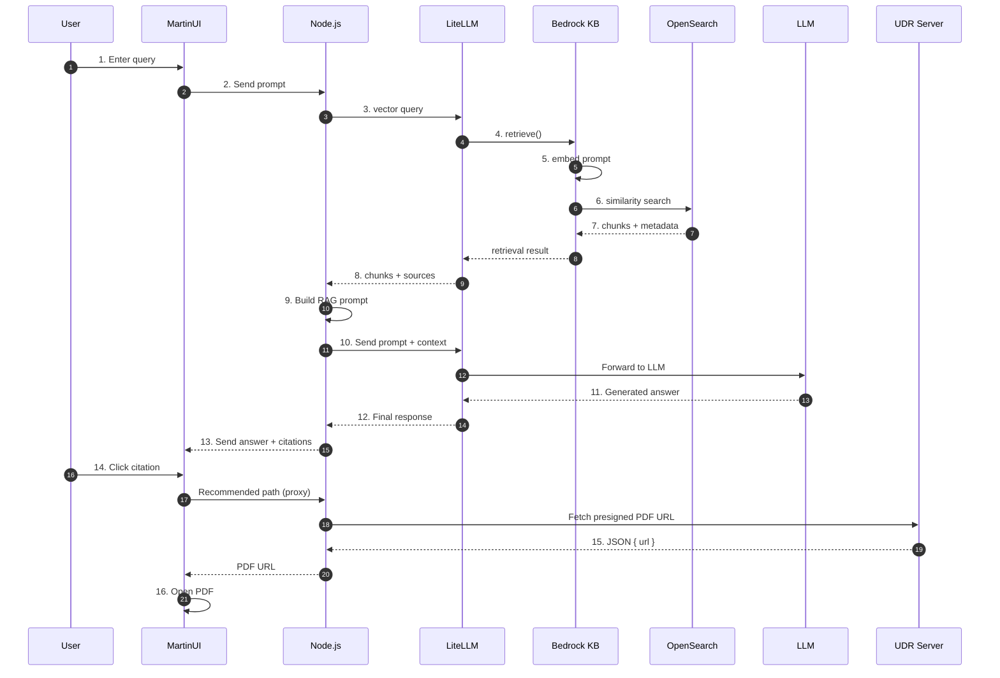

# **Public Data RAG : Design and Architecture Document**

*Intelligent Retrieval-Augmented Agent Using Amazon Bedrock Knowledge Bases and LiteLLM*

---

## **Introduction**

**Public Data RAG** is an intelligent AI application designed to answer complex questions about **internal FOMC minutes**, **archival policy discussions**, and **historical economic data**. It uses **Retrieval-Augmented Generation (RAG)** to retrieve meaningful information from internal document collections and combine it with model reasoning to produce grounded, accurate answers.

The system integrates **Amazon Bedrock Knowledge Bases**, **OpenSearch Vector Search**, and **LiteLLM** to surface the most relevant historical passages from decades of FOMC material. This combination enables high-quality, context-aware responses that remain faithful to original documents.

This document provides a clear overview of the architecture, the information flow, and how each component contributes to the retrieval and generation process. It is written to support engineers who may benefit from a structured, accessible explanation of RAG, embeddings, and Bedrock Knowledge Bases. The goal is to keep the overall system understandable, maintainable, and ready for future enhancements.

---

## **What is Retrieval-Augmented Generation (RAG)?**

Retrieval-Augmented Generation is a method of strengthening Large Language Models (LLMs) by giving them access to **relevant documents at query time**.

Without RAG, an LLM works only from its pretraining and cannot access internal FOMC documents, meeting notes, or other proprietary sources.

With RAG:

1. The user submits a question.
2. A vector database is searched for semantically similar passages.
3. Only those passages (“chunks”) are retrieved.
4. These chunks are passed to the LLM along with the question.
5. The LLM synthesizes an answer grounded in that evidence.
6. Citations are added so users can verify the sources.

This approach produces:

* Higher accuracy
* Answers grounded in internal documents
* Instant knowledge updates without retraining
* Clear traceability via citations

---

## **High-Level System Overview**

The Public Data RAG system integrates the following components:

* **MartinUI** – user-facing interface
* **Node.js API** – orchestrates retrieval and generation
* **LiteLLM** – unified gateway for LLM and vector store calls
* **Amazon Bedrock Knowledge Bases** – manages embeddings, storage, and similarity search
* **OpenSearch Vector Store** – performs fast semantic search
* **Bedrock LLM** – generates the final answer
* **UDR Server** – returns pre-signed PDF URLs for source documents

Each component plays a distinct role, creating a clean separation of responsibilities across UI, retrieval, generation, and document resolution.

---

## **Architecture Flow**

This diagram illustrates the full flow of a user query across the system. MartinUI sends the question to Node.js, which initiates a vector search through LiteLLM and the Bedrock Knowledge Base. The Knowledge Base embeds the query, performs a similarity search in OpenSearch, and returns the most relevant document chunks. Node.js then constructs a RAG prompt and sends it to the Bedrock LLM to generate a grounded answer. If the user clicks a citation, Node.js fetches a pre-signed PDF link from the UDR server, allowing MartinUI to display the underlying source.

---

## **Sequence Diagram**

---

## **Detailed Flow Description**

### **Retrieval and Generation Workflow**

1. **User → MartinUI**
   The user enters a question such as:
   *“Summarize all FOMC meeting notes from 1936 to 1967.”*

2. **MartinUI → Node.js**
   The UI forwards the prompt to the backend.

3. **Node.js → LiteLLM Vector API**
   Node.js begins the retrieval phase by asking LiteLLM for relevant documents.

4. **LiteLLM → Bedrock Knowledge Base**
   LiteLLM forwards the request to the Knowledge Base’s `retrieve` API.

5. **Prompt embedding**
   The Knowledge Base embeds the prompt using the same model used during ingestion.

6. **Similarity search in OpenSearch**
   The embedding is compared to stored vectors to find semantically similar chunks.

7. **Return relevant chunks**
   OpenSearch returns top-matching passages with metadata.

8. **LiteLLM → Node.js**
   Node.js receives the chunks and their associated sources.

9. **Node.js constructs a RAG prompt**
   The backend builds a prompt that includes:

   * user question
   * retrieved passages
   * instructions for summarizing
   * instructions for including citations

10. **Node.js → LiteLLM → LLM**
    The enriched prompt is sent to the Bedrock LLM.

11. **LLM generates a grounded answer**
    The model synthesizes an answer based on the provided context.

12. **Answer returned to Node.js**
    LiteLLM delivers the final response.

13. **Node.js → MartinUI**
    The UI receives the answer and displays it with citations.

---

### **Document Retrieval Workflow**

14. **User clicks a citation in MartinUI**
    This initiates a request to retrieve the underlying document.

15. **Node.js → UDR server**
    Node.js requests a pre-signed PDF URL using citation metadata.

16. **MartinUI opens the PDF**
    The UI extracts the URL and loads the PDF in a new tab.

---

## **Key Concepts Explained**

### **Embeddings**

Embeddings convert text into numerical vectors that capture meaning. Similar texts generate vectors that lie close together in vector space.

### **Vector Search**

Instead of matching keywords, vector search finds semantically similar content—ideal for historical narrative documents such as FOMC minutes.

### **Chunks**

Long documents are broken into smaller segments to improve retrieval quality and allow precise citations.

### **Knowledge Base**

Amazon Bedrock Knowledge Bases manage ingestion, chunking, embedding, indexing, and retrieval, reducing operational overhead.

### **LLM Generation**

Once chunks are retrieved, an LLM synthesizes a clear, structured answer grounded in those chunks.

### **Citations**

Each chunk carries metadata so users can trace statements back to original documents.

### **UDR Server**

The UDR server generates pre-signed URLs, providing secure, time-limited access to the original PDFs.

---

## **Summary**

The Public Data RAG system brings together several proven components to deliver precise, context-rich answers from internal FOMC minutes and historical economic data. It combines **accurate retrieval using OpenSearch and embeddings**, **automated document handling through Bedrock Knowledge Bases**, **reliable orchestration via Node.js and LiteLLM**, and a **clear, intuitive interface in MartinUI**.

This architecture supports production-grade RAG while shielding users from underlying complexity. Its modular design makes the system straightforward to maintain and well-positioned for future enhancements, including structured knowledge bases, SQL-driven agents, intelligent routing, and multi-agent workflows.