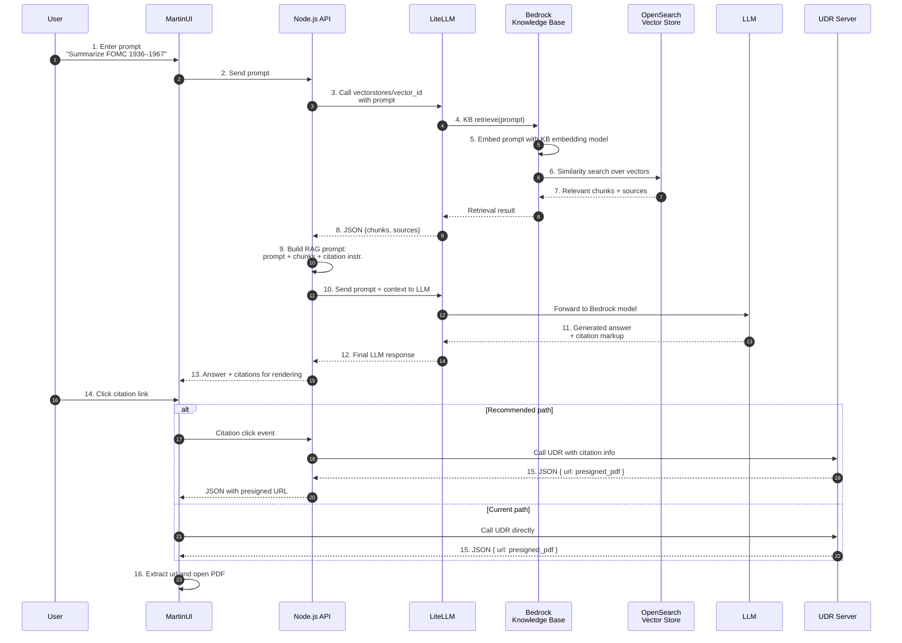

## End-to-end flow (explained for a team new to RAG)

1. **User → MartinUI**
   The user types a natural-language question in MartinUI, for example:
   “Summarize all FOMC meeting notes that took place from 1936 through 1967.”
   MartinUI treats this as a plain text prompt and sends it to the backend.

2. **MartinUI → Node.js API**
   MartinUI calls the Node.js server with the prompt. At this point the backend decides whether this is a RAG query and which tools to use.

3. **Node.js → LiteLLM vector API (retrieval phase starts)**
   Node.js calls LiteLLM’s `vectorstores/vector_id` endpoint, passing the user prompt. This is the “retrieve” step of RAG: we are asking, “Given this query, which documents are relevant?”

4. **LiteLLM → Bedrock Knowledge Base `retrieve`**
   Behind the scenes, LiteLLM forwards the request to Amazon Bedrock Knowledge Bases using the `retrieve` API for the configured vector store.

5. **Knowledge Base → Embedding the query**
   The Bedrock Knowledge Base embeds the user prompt using the *same* embedding model that was used when the documents were indexed. This converts the text into a numeric vector that captures its meaning.

6. **Knowledge Base → OpenSearch similarity search**
   The Knowledge Base performs a similarity search against the OpenSearch vector index. It compares the query vector with document vectors to find the most relevant passages (“top-k” chunks).

7. **OpenSearch → Knowledge Base → LiteLLM: chunks + sources**
   OpenSearch returns the list of best-matching chunks plus their metadata (sources, document IDs, collection names, etc.). The Knowledge Base packages these as a retrieval result and LiteLLM returns them to Node.js as JSON.

8. **LiteLLM → Node.js: retrieval result**
   Node.js receives `chunks + sources` from LiteLLM. At this point, we have **context**, but not yet a nice human-readable answer.

9. **Node.js builds the RAG prompt (generation phase setup)**
   Node.js formats a new prompt that:

   * Injects the retrieved chunks as context.
   * Instructs the LLM to synthesize a professional, coherent answer.
   * Explicitly asks the LLM to include citations (the sources) at the end of the answer.
     This is the classic RAG “prompt + context” pattern.

10. **Node.js → LiteLLM → LLM: prompt + context + sources**
    Node.js sends this constructed prompt, along with the context and citation metadata, to the LLM via LiteLLM’s normal chat/completions API (not the vector API). LiteLLM forwards the request to the configured Bedrock model.

11. **LLM generates the answer**
    The LLM reads the instructions and the retrieved chunks, then:

    * Summarizes and reasons over the content.
    * Produces a well-structured answer.
    * Appends citations that link back to the original documents.

12. **LLM → LiteLLM → Node.js: final answer**
    LiteLLM streams or returns the LLM’s response to Node.js. Node.js now has a fully formatted answer plus citation metadata.

13. **Node.js → MartinUI: renderable response**
    Node.js sends the final answer back to MartinUI. MartinUI renders the answer in the chat interface, along with clickable citation links for each source.

14. **User clicks a citation (current vs. desired path)**
    When the user clicks a citation, MartinUI needs to fetch the underlying document.

    * **Current:** MartinUI calls the remote UDR API server directly with the citation metadata.
    * **Target (recommended):** MartinUI calls Node.js, and Node.js calls the UDR server as a proxy. This keeps all external calls behind the backend and simplifies security and logging.

15. **UDR server returns pre-signed URL JSON**
    The UDR server responds with JSON that contains a field such as `url`, which is a pre-signed URL for the requested PDF file stored in S3 or another document store.

16. **MartinUI opens the PDF**
    MartinUI parses the JSON, extracts the `url`, and opens it (for example, in a new browser tab). The user sees the original PDF that was used as the source for the RAG answer.

